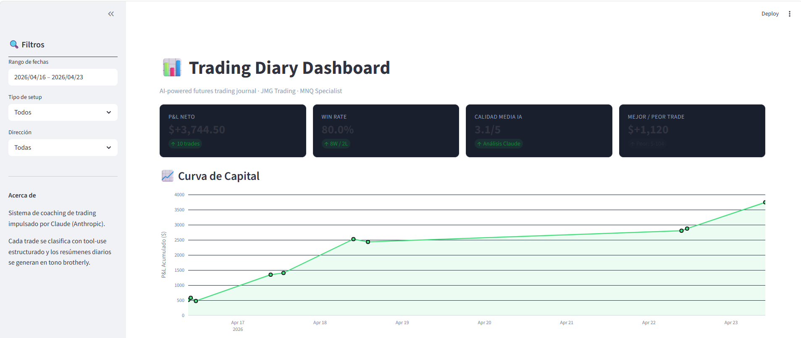
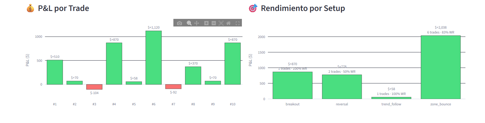
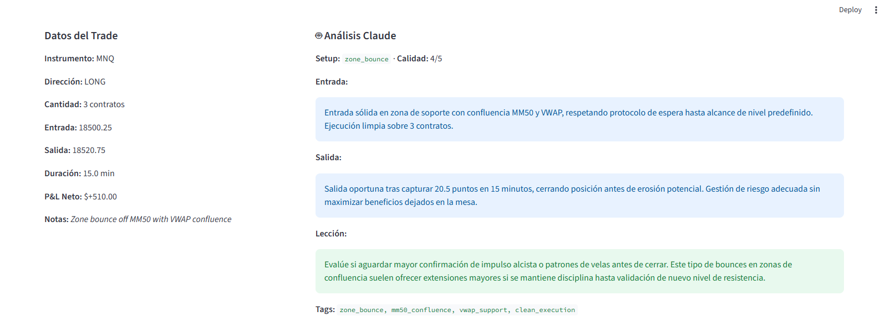

# Trading Diary Agent

An AI-powered trading journal that turns raw broker exports into a coaching feedback loop. Built for discretionary futures traders who want pattern detection and honest, structured review without spending an hour writing notes after every session.

Uses [Claude](https://www.anthropic.com/) (Anthropic API) for structured trade classification and natural-language summaries. Stores everything locally in SQLite — no cloud, no SaaS, your data stays on your machine.

## Dashboard preview

The Streamlit dashboard provides a complete overview of trading performance with KPIs, equity curve, per-trade breakdown, and detailed Claude analysis for each operation.



Performance breakdown by setup type and execution quality distribution.



Detailed Claude analysis for any individual trade, including entry quality, exit quality, lesson learned and pattern tags.



## Why this exists

Most trading journals are spreadsheets. Spreadsheets give you P&L, not feedback. This agent:

- Classifies each trade by setup type (zone bounce, breakout, reversal, trend-follow, news-driven, other)
- Scores execution quality 1-5 against your stated methodology
- Extracts pattern tags so you can see *why* you win and lose, not just *that* you do
- Generates a professional coaching summary on demand (day / week / month) in Spanish
- Runs locally; your trade data never leaves your machine except for the LLM call itself

## Architecture

```
CSV export  ─►  importer.py  ─►  SQLite (trades)
                                      │
                                      ▼
                                analyzer.py  ─►  Anthropic API (Claude Haiku 4.5)
                                      │              with tool-use → structured output
                                      ▼
                                SQLite (analyses)
                                      │
                                      ▼
                                summarizer.py ─►  Anthropic API (Claude Sonnet 4.6)
                                      │              natural-language coaching summary
                                      ▼
                                dashboard.py  ─►  Streamlit + Plotly web UI
```

**Stack:** Python 3.11+, Pydantic v2, SQLite, Anthropic SDK, Typer (CLI), Rich (terminal UI), Streamlit + Plotly (web dashboard), pytest.

**Key engineering choices:**
- **Structured outputs via tool use, not JSON parsing.** The analyzer defines an Anthropic tool schema and forces the model to call it (`tool_choice={"type": "tool", "name": ...}`). This eliminates the markdown-fence-stripping / JSON-repair dance and gives you a typed Pydantic object every time.
- **Two-model split.** Haiku 4.5 for per-trade analysis (cheap, fast, runs over hundreds of trades). Sonnet 4.6 for summaries (better reasoning, lower volume). Override via env vars.
- **Idempotent imports + upsert analyses.** Re-running `analyze --all` overwrites instead of duplicating.
- **No ORM.** Plain SQL with a thin wrapper. The schema is 30 lines; an ORM would be more code than the thing it abstracts.

## Quick start

```bash
git clone https://github.com/jmgindicators/trading-diary-agent.git
cd trading-diary-agent

# One-shot setup (creates venv, installs, imports sample data)
./scripts/quickstart.sh

# Add your API key
cp .env.example .env
# edit .env and paste your ANTHROPIC_API_KEY

# Activate the venv
source .venv/bin/activate    # Linux/macOS
.venv\Scripts\activate       # Windows

# Run the CLI
diary analyze
diary summary day 2026-04-16
diary list -n 10

# Optional: launch the web dashboard
streamlit run dashboard.py
```

## CSV format

The importer expects this header (extra columns are ignored):

```
instrument,entry_time,exit_time,direction,entry_price,exit_price,quantity,pnl,commission,notes
```

Datetimes accept `YYYY-MM-DD HH:MM:SS`, `MM/DD/YYYY HH:MM`, ISO 8601, and a few other common formats. Direction accepts `long`/`short`/`buy`/`sell`.

If your broker exports in a different shape, write a 20-line adapter that maps its columns to this schema and call `load_trades_from_csv`.

## Commands

```bash
diary init                          # create the database
diary import <file.csv>             # import trades
diary analyze                       # analyze unanalyzed trades
diary analyze --all                 # re-analyze everything
diary summary day 2026-04-16        # one-day coaching summary
diary summary month 2026-04         # full month review
diary list -n 20                    # last 20 trades with quality scores
diary show 5                        # full analysis for trade #5

# Web dashboard (separate from CLI)
streamlit run dashboard.py          # http://localhost:8501
```

## Example output

```
$ diary show 6
╭─ Trade #6 ─────────────────────────────────────────╮
│ MNQ LONG qty=3                                     │
│ Entry: 2026-04-18 09:45:00 @ 18465.0               │
│ Exit:  2026-04-18 10:30:00 @ 18510.0               │
│ P&L: $+1125.00  Duration: 45.0 min                 │
│ Notes: Best trade of week patient zone entry       │
╰────────────────────────────────────────────────────╯
╭─ Claude analysis ──────────────────────────────────╮
│ Setup: zone_bounce  Quality: 5/5                   │
│                                                    │
│ Entry: Entrada impecable en zona de demanda con    │
│ paciencia, respetando el setup sin adelantarse.    │
│ Comportamiento de manual.                          │
│                                                    │
│ Exit: Salida excelente siguiendo la MM200 con      │
│ trail, capturaste 45 pips ganadores manteniendo    │
│ el posicionamiento hasta confirmación.             │
│                                                    │
│ Lesson: Este es el estándar que debe replicar:     │
│ esperar la zona, entrar limpio, dejar correr con   │
│ la media móvil de tendencia.                       │
│                                                    │
│ Tags: zone_bounce, trailed_exit, patient_entry,    │
│ mm200_follow                                       │
╰────────────────────────────────────────────────────╯
```

## Testing

```bash
pip install -e ".[dev]"
pytest
```

Tests cover model validation, CSV parsing edge cases, and direction/datetime normalization. They run without an API key.

## Roadmap

- [ ] Native adapter for NinjaTrader 8 CSV export format
- [ ] RAG over trade history (semantic search: "show me my best zone bounces in losing sessions")
- [ ] Telegram bot for end-of-day push summaries
- [ ] MCP server so Claude can query the diary directly from any MCP-enabled client
- [ ] Pre-session brief: "yesterday's losing pattern was X, watch for it today"

## License

MIT
